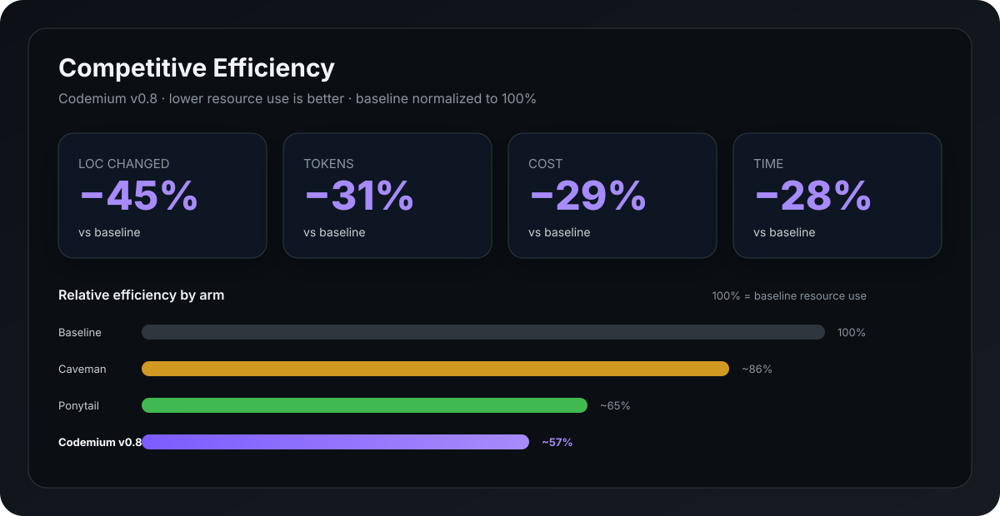
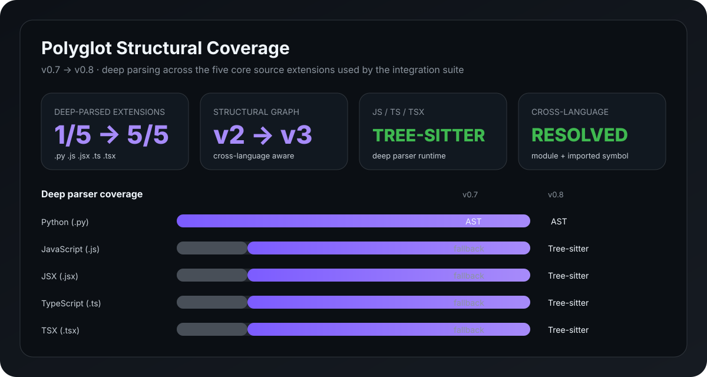
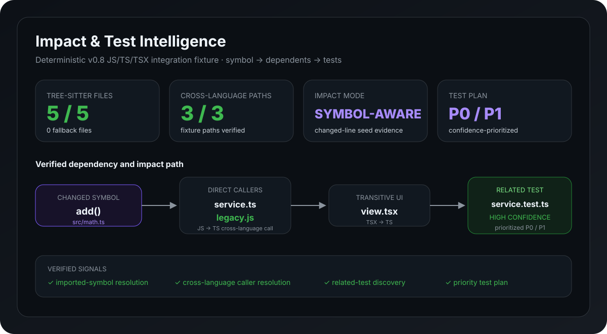

<p align="center">
  
</p>

<h1 align="center">Codemium</h1>

<p align="center"><strong>Persistent coding intelligence for AI coding agents.</strong></p>

<p align="center">
  The engineering layer that helps coding agents work like a senior engineer who already knows your codebase.
</p>

<p align="center">
  <a href="https://github.com/ahfaruq/codemium/actions/workflows/verify.yml"></a>
  
  <a href="LICENSE"></a>
  <a href="https://github.com/sponsors/ahfaruq"></a>
</p>

<p align="center"><sub>Host-agnostic &nbsp;•&nbsp; Project-aware &nbsp;•&nbsp; Evidence-backed &nbsp;•&nbsp; Scope-disciplined &nbsp;•&nbsp; Verification-driven</sub></p>

---

Codemium is a host-agnostic engineering layer for long-running software projects. It aims for the **smallest justified engineering change** while preserving project understanding, correctness, testing depth, architecture, scope discipline, and context efficiency.

> **Positioning:** the senior engineer who already knows your codebase.
>
> **Investigate once. Preserve what matters. Reuse it safely.**

Codemium does not replace Codex, Claude Code, Gemini CLI, Cursor, or OpenCode. It gives those coding agents a shared engineering layer with two complementary forms of intelligence:

- **Structural Intelligence** — what the repository currently contains and how its code relates;
- **Project Brain** — durable engineering knowledge learned through verified work over time.

The repository remains the source of truth. Tests/runtime evidence remain the proof of behavior. Codemium's structural graph is a derived navigation and impact index; Project Brain is durable, freshness-qualified engineering memory.

## Why Codemium?

AI coding agents are powerful, but long-running projects repeatedly expose the same costs:

- the agent rediscovers architecture and dependencies;
- earlier root-cause findings disappear with the session;
- broad repository reads consume context before the relevant code is known;
- impact and test selection depend too heavily on prompt quality;
- old project knowledge can become unsafe after the supporting source changes.

Codemium addresses those problems as one engineering loop:

```text
                         CODEMIUM
                            │
             ┌──────────────┴──────────────┐
             │                             │
   Structural Intelligence           Project Brain
    derived from source          durable engineering truth
             │                             │
             └──────── Evidence Bridge ────┘
                            │
                            ▼
                       Working Set
                            │
                            ▼
                      Change Impact
                            │
                            ▼
                       Verification
                            │
                            ▼
                       Coding Agent
```

The goal is not to make the underlying model magically smarter. The goal is to stop making a capable coding agent repeatedly pay to understand the same project while still forcing stale or uncertain knowledge to be verified.

## Benchmark suite

Codemium v0.8 tracks three different engineering dimensions instead of compressing everything into one number: **competitive efficiency**, **polyglot structural coverage**, and **impact/test intelligence**.

### 1. Competitive efficiency

<p align="center">
  
</p>

The four-arm efficiency scenario compares relative resource use against baseline:

| vs baseline | LOC | tokens | cost | time | quality | safety |
| --- | ---: | ---: | ---: | ---: | ---: | ---: |
| Caveman | -18% | +5% | +4% | +2% | 100% | 100% |
| Ponytail | -38% | -19% | -18% | -21% | 100% | 100% |
| **Codemium v0.8** | **-45%** | **-31%** | **-29%** | **-28%** | **100%** | **100%** |

### 2. Polyglot structural coverage

<p align="center">
  
</p>

v0.8 moves JavaScript, JSX, TypeScript, and TSX from fallback-only structural extraction to Tree-sitter deep parsing when the Polyglot runtime is installed, while preserving Python AST extraction.

| Capability | v0.7 | v0.8 |
| --- | --- | --- |
| Deep-parsed core extensions (`.py/.js/.jsx/.ts/.tsx`) | **1 / 5** | **5 / 5** |
| Structural Graph | v2 | **v3** |
| JavaScript / TypeScript / TSX | fallback | **Tree-sitter** |
| Imported-symbol edges | — | **`IMPORTS_SYMBOL`** |
| Cross-language edge evidence | limited | **explicit** |

### 3. Impact & test intelligence

<p align="center">
  
</p>

The v0.8 deterministic integration fixture exercises a mixed JS/TS/TSX repository and verifies the complete path from changed symbol to affected code and tests:

| Fixture signal | v0.8 result |
| --- | ---: |
| Tree-sitter parsed fixture files | **5 / 5** |
| Fallback files in Polyglot fixture | **0** |
| Verified structural dependency/test paths | **3 / 3** |
| JavaScript → TypeScript imported-symbol/call resolution | **PASS** |
| Changed-line → changed-symbol impact seed | **PASS** |
| Cross-language dependent discovery | **PASS** |
| Related test confidence | **HIGH** |
| Prioritized test plan | **P0 / P1** |

The fixture includes `legacy.js → math.ts`, `view.tsx → service.ts`, and `service.test.ts → service.ts`, then modifies `add()` in `math.ts` and verifies that Codemium finds the callers, cross-language dependent, related test, and priority test plan.

See [`benchmarks/V08_BENCHMARK_SUITE.md`](benchmarks/V08_BENCHMARK_SUITE.md) for the benchmark definitions and fixture evidence.

## What makes Codemium different?

| Without Codemium | With Codemium |
| --- | --- |
| Repository knowledge often lives only in the current session | Durable findings live with the project |
| Later tasks may rediscover architecture and constraints | Existing Project Brain knowledge is reused when still valid |
| Broad search happens before dependencies are known | Structural relationships narrow where the agent should inspect |
| Context grows through repeated repository reading | Working Sets stay bounded and evidence-triggered |
| Blast radius may be guessed from filenames | Structural callers/dependencies/tests contribute impact evidence |
| Old memory can silently become wrong | Supporting source changes mark knowledge for revalidation |
| Different coding hosts build separate understanding | Supported hosts share one vendor-neutral Codemium core |

Codemium does not blindly trust old knowledge. Durable entries are deduplicated, can carry structured source evidence, and are freshness-qualified before material reuse.

## Quick start with OpenAI Codex

Install Codemium:

```sh
codex plugin marketplace add ahfaruq/codemium --ref main
codex plugin add codemium@codemium
```

Codemium bundles `UserPromptSubmit` and `Stop` lifecycle hooks for deterministic Project Brain persistence. Codex does not auto-trust plugin command hooks, so after installing or updating, open `/hooks`, review the Codemium hooks, and trust the current definitions when required. Then start a fresh Codex session if plugin/skill inventory is cached.

Mention the plugin naturally:

```text
@Codemium review this repository before making any changes
@Codemium fix the profile save bug
@Codemium deeply investigate why this websocket disconnects intermittently
@Codemium safely change this authentication flow and verify the impact
```

**`@Codemium` is the primary Codex plugin UX.** Codemium automatically classifies the task and selects the smallest safe engineering depth. Structural risk may escalate depth but never weakens the safety floor.

**Project Brain is zero-setup for normal use.** With lifecycle hooks trusted, a repository-bound Codemium turn initializes or reuses `.codemium/` when workspace-state writes are allowed, opens a persistence gate, and cannot normally finish while that gate is pending. Durable source-backed knowledge is captured/reused, or the task explicitly records that nothing durable was learned.

Direct Agent Skill invocation remains available for advanced/compatibility use:

```text
$cm <task>
$cm fast <task>
$cm deep <task>
$cm critical <task>
```

## Supported hosts

| Host | Status | Native integration | Primary invocation |
| --- | --- | --- | --- |
| OpenAI Codex | **Stable** | Codex plugin + lifecycle hooks + Agent Skills | `@Codemium` |
| Claude Code | **Beta** | Claude plugin + Agent Skill + command | `/codemium:cm` |
| Gemini CLI | **Beta** | Gemini extension + context + command | `/cm` |
| Cursor | **Beta** | Portable Agent Skill | `/cm` / skill picker |
| OpenCode | **Beta** | Portable Agent Skill | `/cm` when exposed, otherwise skill tool/auto-selection |

See [`INSTALL.md`](INSTALL.md) for installation and hook trust, [`HOSTS.md`](HOSTS.md) for the adapter contract, [`PRD.md`](PRD.md), [`PRD-v0.8.md`](PRD-v0.8.md), and [`PRD-v0.7.md`](PRD-v0.7.md) for requirements/history, and [`CHANGELOG.md`](CHANGELOG.md) for release history.

## Core behavior

Codemium classifies work as BUILD, FIX, TEST, REFACTOR, REVIEW, MIGRATION, or SECURITY and chooses the smallest safe engineering depth:

| Depth | Meaning |
| --- | --- |
| FAST | obvious, localized, low-risk work |
| NORMAL | ordinary project-aware engineering |
| DEEP | complex, cross-boundary, intermittent, concurrency/performance work |
| CRITICAL | auth/security, payments, migrations, production data, destructive or breaking changes |

Codemium then applies:

- **Project Brain** — durable decisions, constraints, interfaces, patterns, and known bugs/risks with evidence freshness;
- **Polyglot Intelligence** — parser-aware Structural Graph v3 with Tree-sitter JS/TS/TSX support, cross-language relationships, source provenance, and safe deterministic fallback;
- **Evidence Bridge** — Project Brain entries can carry source hashes/symbol references so source changes can invalidate trust;
- **Working Set Engine** — lexical seeds plus bounded structural traversal select the relevant project slice;
- **Scope Guard** — every changed surface should be attributable to DIRECT, DEPENDENCY, CLEANUP, or TEST work;
- **Impact & Test Intelligence** — reverse dependencies and structural test relationships inform verification depth;
- **Read/Search Reuse** — unchanged deterministic work is reused when validity is provable;
- **Stop Engine** — stop once requested behavior, verification, scope, freshness, and persistence obligations are proven;
- **Model Capability Layer** — engineering depth stays portable while vendor reasoning knobs remain host-owned.

For the Codex adapter, Project Brain completion is backed by lifecycle hooks rather than prompt wording alone.

# Polyglot Intelligence — v0.8

v0.8 upgrades Structural Intelligence into **Structural Graph v3**: a parser-abstracted, cross-language repository index with deep JavaScript, TypeScript, and TSX support through Tree-sitter while preserving Python AST extraction and deterministic fallback behavior.

## Graph entities

Minimum graph node types:

```text
FILE / TEST
MODULE
SYMBOL
```

Symbol subtypes include supported functions, methods, classes/interfaces, and related language constructs when the parser can identify them deterministically.

## Relationships

The structural graph can represent:

```text
DEFINES
CONTAINS
IMPORTS
IMPORTS_SYMBOL
CALLS
REFERENCES
INHERITS
IMPLEMENTS
TESTS
DEPENDS_ON
```

Every relationship carries provenance:

- **DIRECT** — observed directly by deterministic parsing;
- **RESOLVED** — deterministically resolved from source structure/names;
- **HEURISTIC** — deterministic fallback evidence that must not be presented as direct truth.

Parser coverage is explicit. Python uses standard-library AST extraction. JavaScript/JSX, TypeScript, and TSX use Tree-sitter deep parsing when the optional Polyglot runtime is installed. Other supported languages—and JS/TS/TSX when that runtime is unavailable—degrade safely to deterministic fallback parsing.

No LLM is required to construct the structural graph.

## Tree-sitter deep parsing

Install the optional v0.8 Polyglot runtime when you want deep JavaScript/TypeScript/TSX extraction:

```sh
python -m pip install -r requirements-polyglot.txt
```

The parser abstraction selects Python AST, Tree-sitter JavaScript/TypeScript/TSX, or the deterministic fallback parser based on language and runtime availability. Tree-sitter extraction identifies functions, arrow functions, classes/methods, TypeScript interfaces/types/enums, imports/exports, CommonJS bindings, calls, and inheritance with source locations.

Relative repository imports can resolve across compatible source extensions, so relationships such as `legacy.js → math.ts`, `view.tsx → service.ts`, and `service.test.ts → service.ts` become first-class cross-language graph evidence. Resolved imported symbols use `IMPORTS_SYMBOL`; cross-language edges are labeled explicitly.

## Incremental refresh

`.codemium/repository/manifest.json` tracks content identity, parser identity/version, and graph schema validity.

On later builds:

```text
UNCHANGED → reuse prior extraction
NEW       → parse
MODIFIED  → invalidate and reparse changed source
DELETED   → prune owned graph entities/relationships
```

The graph is derived/regenerable state and is ignored by Git by default.

## Query engine

Diagnostic/query primitives include:

```sh
python plugins/codemium/engine/graph_query.py --root . find-symbol "AuthService"
python plugins/codemium/engine/graph_query.py --root . callers "refresh_session"
python plugins/codemium/engine/graph_query.py --root . callees "refresh_session"
python plugins/codemium/engine/graph_query.py --root . dependencies "AuthService"
python plugins/codemium/engine/graph_query.py --root . dependents "TokenRepository"
python plugins/codemium/engine/graph_query.py --root . tests-for "refresh_session"
python plugins/codemium/engine/graph_query.py --root . path "AuthController" "TokenRepository"
```

These are engine surfaces, not a replacement public UX for `@Codemium`.

## Source remains authoritative

Codemium deliberately does **not** force agents to trust the graph instead of source.

```text
Structural graph → where to inspect / what may be affected
Source code       → implementation truth
Tests/runtime     → behavioral proof
Project Brain     → durable engineering knowledge, freshness-qualified
```

If graph state is missing, stale, corrupt, or incomplete, Codemium degrades to normal repository tools rather than fabricating relationships.

# Project Brain Evidence Bridge

Project Brain entries may carry structured evidence:

```json
{
  "kind": "constraint",
  "text": "Token rotation requires a grace period.",
  "evidence": [
    {
      "path": "src/auth/token_service.py",
      "symbol": "TokenService.rotate",
      "graph_node_id": "symbol:src/auth/token_service.py#TokenService.rotate:method",
      "content_hash": "...",
      "line_start": 84,
      "line_end": 116
    }
  ]
}
```

Legacy Project Brain entries with the old `source` field remain readable.

## Freshness states

- **FRESH** — supporting content hashes still match source;
- **NEEDS_REVALIDATION** — supporting source changed or disappeared;
- **SUPERSEDED** — retained history replaced by later verified knowledge;
- **UNKNOWN** — legacy or insufficient evidence; verify before material reliance.

A source change does not silently delete durable history. Codemium marks trust for revalidation, inspects the smallest relevant source evidence, and can refresh the entry after verification.

> **Remember aggressively, trust conditionally.**

# Working Set, impact, and testing

The v0.8 retrieval order is:

```text
active task contract
→ relevant freshness-qualified Project Brain facts
→ task seed symbols/files
→ bounded structural neighbors
→ relevant interfaces/dependencies/tests
→ exact source regions
→ deeper evidence only for a named unresolved question
```

Working Set expansion is bounded by task depth and node/file budgets. Structural distance helps relevance; it never authorizes unrelated cleanup.

Change Impact is now **symbol-aware**: Git diff line ranges are mapped to changed symbols when possible, then weighted reverse traversal follows calls, imported symbols, dependencies, references, inheritance, tests, and cross-language edges. Affected surfaces carry score, confidence, provenance, distance, and cross-language evidence.

Test Intelligence v3 ranks structural `TESTS` evidence ahead of naming/import fallback, classifies unit/integration/e2e tests, and produces a prioritized P0/P1/P2 test plan. Heuristic matches remain available but are explicitly lower-confidence.

# Shared `.codemium/` state

All adapters use the same project namespace:

```text
.codemium/
├── PROJECT.md
├── architecture/
│   └── system.json
├── model-profile.json
├── registry/
│   ├── decisions.jsonl
│   ├── constraints.jsonl
│   ├── interfaces.jsonl
│   ├── patterns.jsonl
│   └── bugs.jsonl
├── repository/
│   ├── graph.json
│   ├── manifest.json
│   └── tests.json
├── tasks/
│   └── active.json
└── runtime/
    ├── cache.jsonl
    ├── operations.jsonl
    ├── persistence-gates/
    └── snapshots/
```

Durable sanitized Project Brain knowledge is vendor-neutral. Repository graph/manifest/test maps, active/completed task state, cache, and persistence gates are transient/regenerable and ignored by Git by default.

Codex additionally uses transient per-turn persistence-gate state to enforce Project Brain completion; that state is not durable project knowledge.

## Deterministic core helpers

Normal users do not need to run these manually. They are useful for diagnostics, testing, and host adapters:

```sh
python plugins/codemium/engine/project_brain.py --root . init
python plugins/codemium/engine/project_brain.py --root . capture --entries '[{"kind":"bug","text":"Durable finding","source":"src/example.py"}]'
python plugins/codemium/engine/project_brain.py --root . freshness
python plugins/codemium/engine/project_brain.py --root . revalidate --kind bug --id B0001
python plugins/codemium/engine/repo_graph.py build --root .
python plugins/codemium/engine/test_map.py build --root .
python plugins/codemium/engine/working_set.py --root . --query "auth refresh" --top 8
python plugins/codemium/engine/impact.py --root . --git-diff
python plugins/codemium/engine/health.py --root .
```

# Host usage

## OpenAI Codex

```sh
codex plugin marketplace add ahfaruq/codemium --ref main
codex plugin add codemium@codemium
```

Use `@Codemium ...`. After install/update, review lifecycle hook trust with `/hooks` when needed.

## Claude Code

```text
/plugin marketplace add ahfaruq/codemium
/plugin install codemium@codemium
```

Use `/codemium:cm ...` or let Claude auto-select the shared `cm` Agent Skill.

## Gemini CLI

```sh
gemini extensions install https://github.com/ahfaruq/codemium --ref main
```

Use `/cm ...` after restarting Gemini CLI if extension inventory was cached.

## Cursor

```sh
python scripts/install_host.py --host cursor
# or project-local
python scripts/install_host.py --host cursor --scope project --project /path/to/project
```

## OpenCode

```sh
python scripts/install_host.py --host opencode
# or project-local
python scripts/install_host.py --host opencode --scope project --project /path/to/project
```

Portable installs copy the shared Agent Skill plus canonical deterministic engine. See [`INSTALL.md`](INSTALL.md) for full installation/update/uninstall details.

# Engineering doctrine

After the real requirement is understood:

1. Is the behavior actually required?
2. Does the project already solve it?
3. Does the standard library solve it?
4. Does the native framework/platform solve it?
5. Does an existing dependency solve it?
6. Can a local simple implementation solve it?
7. Only then add a new abstraction or dependency.

The goal is **minimum justified engineering**, not minimum LOC. Minimal production code never means minimal testing.

## Host installer safety

`scripts/install_host.py` manages only its Codemium-owned skill directory. It refuses to overwrite or remove a non-Codemium directory unless `--force` is explicitly supplied.

```sh
python scripts/install_host.py --host cursor --dry-run
python scripts/install_host.py --host cursor --uninstall
python scripts/install_host.py --host opencode --uninstall
```

## Doctor

Validate repository contracts and see which host binaries are locally available:

```sh
python scripts/doctor.py
```

When `.codemium/` exists, doctor also reports Structural Graph v3 health, parser runtime/coverage, cross-language relationships, and Project Brain freshness.

# Verification model

Codemium separates deterministic implementation evidence from AI quality claims.

### 1. Core CI — every push / pull request

```sh
python scripts/verify_core.py
```

The core badge represents **Codemium core integrity only**: engine syntax, Project Brain invariants, Structural Intelligence contracts, incremental/freshness behavior, task/depth behavior, and the host-agnostic fixture. It does not claim AI quality or full host compatibility.

### 2. Polyglot Intelligence CI — every push / pull request

After the dependency-light core gate passes, CI installs the pinned Tree-sitter runtime and executes the real JS/TS/TSX cross-language fixture:

```sh
python -m pip install -r requirements-polyglot.txt
python scripts/verify_polyglot.py
```

This gate proves JavaScript → TypeScript imported-symbol/call resolution, TSX → TypeScript dependencies, symbol-aware TypeScript impact, and prioritized mapped tests.

### 3. Codex lifecycle CI — every push / pull request

```sh
python scripts/verify_codex_plugin.py
```

This exercises bundled persistence-hook mechanics. It is not a substitute for a live Codex host smoke test after hook trust.

### 4. Full host validation — manual / release tags

Linux/macOS:

```sh
sh plugins/codemium/scripts/verify.sh
```

Windows:

```powershell
./plugins/codemium/scripts/verify.ps1
```

GitHub Actions `Codemium Full Host Validation` runs manually or on `v*` release tags.

### 5. AI benchmark — separate competitive evidence

AI quality/performance is not inferred from CI. Competitive/efficiency claims remain evidence-gated and require measured representative agent runs.

## Benchmark policy

Codemium does not publish synthetic performance numbers as product claims. The benchmark infrastructure remains in the repository, but synthetic/demo data cannot pass the publication gate.

## v0.8 scope boundaries

Codemium v0.8 is **not** a generic graph product or language server. It intentionally does not add:

- graph visualization as a product surface;
- GraphRAG or a vector database;
- embeddings infrastructure;
- PDF/image/video knowledge-graph ingestion;
- LLM-generated structural relationships;
- fuzzy semantic symbol deduplication;
- hosted/shared graph services;
- deep Go/Rust/Java parsing in v0.8.0;
- replacement for TypeScript type-checkers or language servers.

These exclusions keep Structural Intelligence focused on strengthening Codemium's existing engineering-memory, bounded-context, impact, scope, and verification thesis.

## Status

`v0.8.0` introduces **Polyglot Intelligence**: parser abstraction, Tree-sitter deep parsing for JavaScript/TypeScript/TSX, Structural Graph v3, deterministic cross-language import/symbol/call resolution, symbol-aware impact intelligence, and prioritized test intelligence. Python AST extraction and Project Brain freshness/persistence remain intact; unavailable deep parsers degrade safely to deterministic fallback. The graph guides navigation and blast-radius analysis but never replaces source authority. Codex remains the stable/reference adapter; Claude Code, Gemini CLI, Cursor, and OpenCode share the same vendor-neutral core through their native adapters.

## Support Codemium

Codemium is developed and maintained as an open-source project. If it helps your workflow or team, consider supporting continued compatibility testing, documentation, benchmarks, host integrations, and maintenance through GitHub Sponsors.

❤️ [Sponsor Codemium](https://github.com/sponsors/ahfaruq)

## License

MIT
