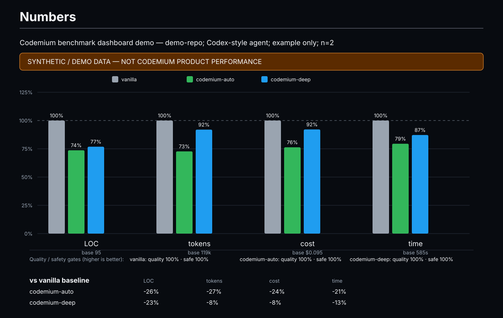

# Codemium

**Persistent coding intelligence for Codex.**

Codemium is a Codex-first plugin for long-running software projects. It aims for the **smallest justified engineering change** while preserving project understanding, correctness, testing depth, architecture, scope discipline, and token efficiency.

> **Positioning:** the senior engineer who already knows your codebase.

## The short UX

The primary tag is intentionally tiny:

```text
@cm
```

That is the normal/default experience. Codemium automatically detects both the coding task and the engineering depth.

Optional depth overrides:

```text
@cm fast
@cm deep
@cm critical
```

There is deliberately no need to type `normal`; plain `@cm` is auto mode and will usually resolve to NORMAL for ordinary work.

Examples:

```text
@cm fix the profile save bug
@cm fast adjust the card spacing
@cm deep investigate why the websocket disconnects intermittently
@cm critical change the authentication flow
```

Focused shortcuts are available when you want to pin the task type:

```text
@cm-fix
@cm-test
@cm-review
@cm-audit
@cm-health
@cm-init
```

Focused shortcuts can also receive a depth override when it makes sense:

```text
@cm-fix deep
@cm-test critical
@cm-review deep
```

## Depth + reasoning profile

Depth controls engineering investigation/context/verification. Codemium also derives a **preferred reasoning effort** for the effective depth:

| Codemium depth | Preferred reasoning | Typical use |
| --- | --- | --- |
| FAST | `low` | obvious localized low-risk work |
| NORMAL | `medium` | ordinary project-aware engineering |
| DEEP | `high` | complex, cross-boundary, intermittent, concurrency/performance work |
| CRITICAL | `xhigh` | auth/security, payments, migrations, production data, destructive or breaking changes |

For GPT-5.6 Sol/Terra/Luna these effort labels are supported. GPT-5.6 also supports `max`, but Codemium does **not** make `max` the automatic CRITICAL default. Use it only for the hardest quality-first workloads after representative benchmarks show a material gain over `xhigh`.

### Important host-control rule

`@cm fast` does not magically rewrite the current Codex model selector.

Codemium treats reasoning as a per-task preference:

1. resolve the effective depth;
2. resolve preferred/minimum reasoning effort;
3. if the Codex runtime exposes confirmed safe **per-task** effort control, request it;
4. otherwise keep the host setting and apply Codemium's bounded-context/tool/verification policy;
5. never silently rewrite global Codex configuration;
6. never claim reasoning changed unless the runtime confirms the effective setting.

So if the current host is GPT-5.6 Sol `xhigh` and you run:

```text
@cm fast adjust card padding
```

Codemium resolves:

```text
Depth: FAST
Preferred reasoning: low
Host: xhigh
Alignment: host_above_preferred
```

The orchestration becomes FAST immediately. The model effort only changes if the host supports and confirms that per-task switch.

Safety escalation always wins. For example:

```text
@cm fast change authentication flow
```

resolves to:

```text
Depth: CRITICAL
Preferred reasoning: xhigh
```

## Why Codemium

Coding agents often pay repeatedly for the same understanding: rereading unchanged files, rediscovering architecture, repeating searches/tests, carrying stale conversation history, creating abstractions that the project already solved, or touching nearby code outside the task.

Codemium turns a repository into persistent engineering memory:

- **Project Brain** — durable decisions, constraints, interfaces, patterns, and known bugs.
- **Repository Intelligence** — lightweight file/symbol/import/test graph built deterministically.
- **Task Compiler** — detects BUILD/FIX/TEST/REFACTOR/REVIEW/MIGRATION/SECURITY plus FAST/NORMAL/DEEP/CRITICAL depth and reasoning profile.
- **Working Set Engine** — ranks only files and project knowledge relevant to the task.
- **Scope Guard** — detects files changed outside the allowed surface.
- **Impact Engine** — estimates affected code/tests and blast radius.
- **Test Intelligence** — testing follows behavior and risk, never production-code minimalism.
- **Reasoning Profile Engine** — maps effective depth to preferred/minimum effort and compares it with a known host setting.
- **Read/Search Cache** — reuses deterministic work when repository state has not changed.
- **Stop Engine** — stops once requested behavior is proven and material uncertainty is resolved.
- **Model capability abstraction** — no permanent dependency on one GPT generation.

## Numbers

The purpose of **Numbers** is direct competitive measurement. Codemium is tested **against** the alternatives, not presented as an extension of them.

A primary competitive study has four arms:

- **baseline** — the same coding agent/model/reasoning with no optimization skill;
- **caveman** — terse-prose/minimal-control arm;
- **ponytail** — Ponytail under the same task and environment conditions;
- **codemium** — Codemium `@cm` under those same conditions.

Every arm must receive the **same tasks, same starting repository commit, same agent/model configuration, same environment, and same scoring protocol**. The dashboard compares **LOC, total tokens, measured cost, wall-clock time, quality pass rate, and safety pass rate**.



The chart above is **synthetic demo data only** and is permanently watermarked. It demonstrates the competitive layout; it is not a Codemium performance claim.

A public measured chart must pass the publication gate. Competitive publication requires `meta.kind = measured` and complete `baseline`, `caveman`, `ponytail`, and `codemium` arms covering identical task IDs.

Internal variants such as `@cm fast`, `@cm deep`, or reasoning-profile ablations belong in separate ablation studies. They do not replace Ponytail or caveman in the main competitive benchmark.

See [`benchmarks/README.md`](benchmarks/README.md) for the protocol and [`benchmarks/demo-NUMBERS.md`](benchmarks/demo-NUMBERS.md) for the generated demo summary.

## Install

```sh
codex plugin marketplace add admahmad/codemium --ref main
codex plugin add codemium@codemium
```

Start a fresh Codex task after installation, then use `@cm`.

## Initialize a project

`@cm` may initialize project intelligence when `.codemium/` is missing and durable state creates value. Manual initialization is also available with `@cm-init` or the deterministic helpers:

```sh
python <plugin-dir>/engine/project_brain.py init --root .
python <plugin-dir>/engine/repo_graph.py build --root .
python <plugin-dir>/engine/test_map.py build --root .
```

Project state:

```text
.codemium/
├── PROJECT.md
├── architecture/
│   └── system.json
├── model-profile.json
├── registry/
│   ├── decisions.jsonl
│   ├── constraints.jsonl
│   ├── interfaces.jsonl
│   ├── patterns.jsonl
│   └── bugs.jsonl
├── repository/
│   ├── graph.json
│   └── tests.json
├── tasks/
│   └── active.json
└── runtime/
    ├── cache.jsonl
    ├── operations.jsonl
    └── snapshots/
```

## Task compiler

The deterministic task compiler mirrors the tag behavior:

```sh
python <plugin-dir>/engine/task_compiler.py \
  --root . \
  --request "Investigate intermittent queue race bug"
```

Explicit depth plus known host profile:

```sh
python <plugin-dir>/engine/task_compiler.py \
  --root . \
  --depth fast \
  --model gpt-5.6-sol \
  --host-effort xhigh \
  --request "Adjust card padding"
```

Standalone reasoning alignment:

```sh
python <plugin-dir>/engine/reasoning_profile.py \
  --depth fast \
  --model gpt-5.6-sol \
  --host-effort xhigh
```

Supported depth overrides are `auto`, `fast`, `deep`, and `critical`. NORMAL is an internal auto-selected depth.

## Engineering doctrine

Codemium uses this solution ladder **after** the problem is understood:

1. Is the requested behavior actually required?
2. Does the codebase already solve it?
3. Does the standard library solve it?
4. Does the native platform/framework solve it?
5. Does an existing dependency solve it?
6. Can a local simple implementation solve it?
7. Only then add a new abstraction or dependency.

The center of gravity is **minimum justified engineering**, not minimum LOC.

## Testing is not minimized

Production-code minimalism must never be used as a reason to under-test. Verification depth follows blast radius and risk, from targeted local checks through subsystem/full/runtime verification where justified.

## Token claims

Codemium does **not** invent exact token savings. If the host exposes real token usage, benchmark it. Otherwise Codemium reports deterministic proxies such as working-set size, duplicate operations, repeated reads, test reuse, and persistent-state footprint.

## Validate this repository

```sh
sh plugins/codemium/scripts/verify.sh
```

Windows:

```powershell
powershell -ExecutionPolicy Bypass -File plugins/codemium/scripts/verify.ps1
```

## Status

`v0.4.0` adds the competitive Numbers benchmark dashboard, measured-vs-synthetic publication gate, and reproducible benchmark renderer on top of adaptive reasoning profiles and persistent project intelligence.

## License

MIT
