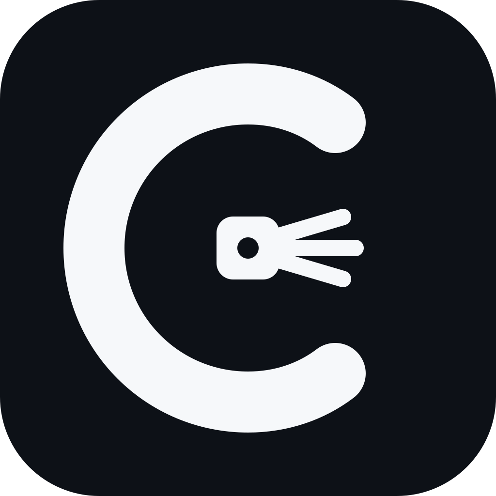

<p align="center">
  
</p>

<h1 align="center">Codemium</h1>

<p align="center"><strong>Persistent coding intelligence for AI coding agents.</strong></p>

<p align="center">
  The engineering layer that helps coding agents work like a senior engineer who already knows your codebase.
</p>

<p align="center">
  <a href="https://github.com/ahfaruq/codemium/actions/workflows/verify.yml"></a>
  
  <a href="LICENSE"></a>
  <a href="https://github.com/sponsors/ahfaruq"></a>
</p>

<p align="center"><sub>Host-agnostic &nbsp;•&nbsp; Project-aware &nbsp;•&nbsp; Scope-disciplined &nbsp;•&nbsp; Verification-driven</sub></p>

---

Codemium is a host-agnostic engineering layer for long-running software projects. It aims for the **smallest justified engineering change** while preserving project understanding, correctness, testing depth, architecture, scope discipline, and context efficiency.

> **Positioning:** the senior engineer who already knows your codebase.

Codemium keeps durable project intelligence in `.codemium/`, then exposes the same engineering doctrine through native adapters for each coding-agent host.

## Quick start with OpenAI Codex

Install Codemium:

```sh
codex plugin marketplace add ahfaruq/codemium --ref main
codex plugin add codemium@codemium
```

Codemium `0.6.2` bundles lifecycle hooks for deterministic Project Brain persistence. Codex does not auto-trust plugin command hooks, so after installing or updating open `/hooks`, review the Codemium hooks, and trust the current definitions. Then start a fresh Codex session.

Mention the plugin naturally:

```text
@Codemium review this repository before making any changes
@Codemium fix the profile save bug
@Codemium deeply investigate why this websocket disconnects intermittently
@Codemium safely change this authentication flow and verify the impact
```

**`@Codemium` is the primary Codex plugin UX.** Codemium automatically classifies the task and selects the smallest safe engineering depth. Users do not need to memorize internal skill names or depth syntax.

**Project Brain is zero-setup for normal use.** With the Codex lifecycle hooks trusted, a repository-bound Codemium turn initializes or reuses `.codemium/` when workspace-state writes are allowed, opens a persistence gate, and cannot normally finish while that gate is still pending. Durable source-backed knowledge is captured/reused, or the task explicitly records that nothing durable was learned. A source-code-only instruction such as “do not modify code” still allows Project Brain bookkeeping, while an explicit prohibition on all workspace/file changes is respected.

Codemium does not retroactively convert prior chat history into Project Brain entries. Durable knowledge begins accumulating from tasks that run with the persistence lifecycle active.

Direct Agent Skill invocation remains available for advanced/compatibility use:

```text
$cm <task>
$cm fast <task>
$cm deep <task>
$cm critical <task>
```

## Supported hosts

| Host | Status | Native integration | Primary invocation |
| --- | --- | --- | --- |
| OpenAI Codex | **Stable** | Codex plugin + lifecycle hooks + Agent Skills | `@Codemium` |
| Claude Code | **Beta** | Claude plugin + Agent Skill + command | `/codemium:cm` |
| Gemini CLI | **Beta** | Gemini extension + context + command | `/cm` |
| Cursor | **Beta** | Portable Agent Skill | `/cm` / skill picker |
| OpenCode | **Beta** | Portable Agent Skill | `/cm` when slash exposure is supported, otherwise skill tool/auto-selection |

See [`INSTALL.md`](INSTALL.md) for installation and hook trust, [`HOSTS.md`](HOSTS.md) for the adapter contract, [`PRD.md`](PRD.md) for product requirements, and [`CHANGELOG.md`](CHANGELOG.md) for release history.

## One core, native adapters

```text
                         CODEMIUM
                            │
          ┌─────────────────┼─────────────────┐
          │                 │                 │
     Project Brain     Engineering Core   Shared State
          │                 │                 │
          └─────────────────┼─────────────────┘
                            │
        ┌───────────┬───────┼────────┬────────────┐
        │           │       │        │            │
      Codex       Claude  Gemini   Cursor      OpenCode
        │           │       │        │            │
  @Codemium  /codemium:cm  /cm      /cm        cm skill
    + hooks
```

Invocation syntax, extension format, lifecycle controls, model controls, and tool surfaces are host-specific. The engineering invariants are not.

## Core behavior

Codemium classifies work as BUILD, FIX, TEST, REFACTOR, REVIEW, MIGRATION, or SECURITY and then chooses the smallest safe engineering depth:

| Depth | Meaning |
| --- | --- |
| FAST | obvious, localized, low-risk work |
| NORMAL | ordinary project-aware engineering |
| DEEP | complex, cross-boundary, intermittent, concurrency/performance work |
| CRITICAL | auth/security, payments, migrations, production data, destructive or breaking changes |

Safety may **escalate** depth but never downgrade below the safe minimum.

Codemium then applies:

- **Project Brain** — automatically initialized durable decisions, constraints, interfaces, patterns, and known bugs with end-of-task capture/reuse;
- **Repository Intelligence** — lightweight file/symbol/import/test discovery;
- **Working Set Engine** — only context relevant to the current task;
- **Scope Guard** — no unrelated edits or opportunistic cleanup;
- **Impact & Test Intelligence** — verification follows behavior and blast radius;
- **Read/Search Reuse** — unchanged deterministic work is not paid for twice;
- **Stop Engine** — stop once the requested result and persistence obligations are sufficiently proven;
- **Model Capability Layer** — engineering depth is portable while vendor reasoning knobs remain host-owned.

For the Codex adapter, the Stop Engine's Project Brain obligation is backed by host lifecycle hooks rather than prompt wording alone.

## Engineering doctrine

After the real requirement is understood:

1. Is the behavior actually required?
2. Does the project already solve it?
3. Does the standard library solve it?
4. Does the native framework/platform solve it?
5. Does an existing dependency solve it?
6. Can a local simple implementation solve it?
7. Only then add a new abstraction or dependency.

The goal is **minimum justified engineering**, not minimum LOC. Minimal production code never means minimal testing.

---

# OpenAI Codex

Codex is currently the stable/reference adapter.

## Install

```sh
codex plugin marketplace add ahfaruq/codemium --ref main
codex plugin add codemium@codemium
```

After install/update, open `/hooks`, review the Codemium `UserPromptSubmit` and `Stop` hooks, and trust the current definitions. Start a fresh Codex task after installation if the runtime has cached its plugin or skill inventory.

If the plugin hooks are untrusted or hooks are disabled, Codemium's skill instructions may still load but deterministic persistence enforcement does not run. Do not treat that state as guaranteed Project Brain persistence.

## Use

Primary plugin invocation:

```text
@Codemium fix the profile save bug
@Codemium review this repository before making any changes
@Codemium deeply investigate a race condition
@Codemium safely change authorization behavior and verify the impact
```

Codemium infers task type and engineering depth automatically. Natural language such as “quickly”, “deeply investigate”, or “safely review this critical flow” can express intent, but the safety floor always wins.

Normal `@Codemium` tasks establish/reuse Project Brain automatically. The `UserPromptSubmit` hook opens a per-turn persistence gate, while the `Stop` hook continues the turn if that gate remains pending. Before normal completion, the task must capture/reuse durable source-backed knowledge or classify that it learned none. You do not need to run `$cm-init` before ordinary use.

### Advanced direct skills

Codex also supports direct Agent Skill invocation:

```text
$cm
$cm fast
$cm deep
$cm critical
```

Focused direct skills:

```text
$cm-fix
$cm-test
$cm-review
$cm-audit
$cm-health
```

`$cm-init` remains available as a manual maintenance/diagnostic path, but it is not required before normal `@Codemium` work.

These direct skills are useful for advanced/compatibility workflows; the public product-level entry point is `@Codemium`.

### Codex reasoning mapping

Codemium's portable reasoning classes map to current Codex effort preferences when supported:

| Depth | Portable class | Codex preference |
| --- | --- | --- |
| FAST | economy | `low` |
| NORMAL | balanced | `medium` |
| DEEP | strong | `high` |
| CRITICAL | frontier | `xhigh` |

Codemium never silently rewrites the global Codex model/reasoning selector. A host-effort change is only reported when the runtime confirms it.

---

# Claude Code

Claude Code uses the repository itself as the plugin root so the adapter has access to the same shipped core.

## Install

Inside Claude Code:

```text
/plugin marketplace add ahfaruq/codemium
/plugin install codemium@codemium
```

## Use

Claude may auto-select the `cm` Agent Skill when relevant, or invoke explicitly:

```text
/codemium:cm fix the profile save bug
/codemium:cm fast adjust the card spacing
/codemium:cm deep investigate a race condition
/codemium:cm critical change authorization behavior
```

Claude model/thinking controls remain Claude-owned unless the host documents and confirms a per-task control.

---

# Gemini CLI

Codemium is packaged as a native Gemini CLI extension with `gemini-extension.json`, a deliberately lean `GEMINI.md` bootstrap, the shared `cm` Agent Skill, and `/cm`.

## Install

From a terminal:

```sh
gemini extensions install https://github.com/ahfaruq/codemium --ref main
```

Restart Gemini CLI after installation or update so extension commands/context refresh.

## Use

```text
/cm fix the profile save bug
/cm fast adjust the card spacing
/cm deep investigate a race condition
/cm critical change authentication behavior
```

---

# Cursor

Cursor supports Agent Skills. Codemium installs the shared `cm` bundle together with its deterministic engine and references.

## User-wide install

```sh
python scripts/install_host.py --host cursor
```

## Project-local install

```sh
python scripts/install_host.py --host cursor --scope project --project /path/to/project
```

Then use the `cm` Agent Skill when Cursor discovers it; current Cursor releases expose skills in the slash UI, so `/cm` is the short invocation there. Cursor's current primary CLI entrypoint is `agent`, with `cursor-agent` retained as a compatibility alias.

---

# OpenCode

OpenCode natively discovers Agent Skills. Codemium installs into its skill directories and sets `opencode/slash: "true"` metadata.

## User-wide install

```sh
python scripts/install_host.py --host opencode
```

## Project-local install

```sh
python scripts/install_host.py --host opencode --scope project --project /path/to/project
```

OpenCode can auto-select/load `cm` via its native skill tool. Use `/cm` on versions exposing Agent Skills in the slash catalog.

---

# Shared Project Brain

All adapters use the same project state:

```text
.codemium/
├── PROJECT.md
├── architecture/
│   └── system.json
├── model-profile.json
├── registry/
│   ├── decisions.jsonl
│   ├── constraints.jsonl
│   ├── interfaces.jsonl
│   ├── patterns.jsonl
│   └── bugs.jsonl
├── repository/
│   ├── graph.json
│   └── tests.json
├── tasks/
│   └── active.json
└── runtime/
    ├── cache.jsonl
    ├── operations.jsonl
    ├── persistence-gates/
    └── snapshots/
```

A project initialized under one host can be understood by another host because durable state is vendor-neutral. Transient repository maps/runtime/task state is ignored by Git by default; durable sanitized architecture and decision knowledge can remain project-owned.

For normal repository-bound work, initialization is automatic when state writes are allowed. At completion Codemium classifies persistence as **captured**, **reused**, **none**, or **skipped by user constraint**. Durable entries are evidence-backed and deduplicated; chat transcripts, secrets, speculative hypotheses, and temporary runtime observations are not Project Brain knowledge.

Codex additionally keeps transient per-turn gate state under `.codemium/runtime/persistence-gates/`. That state exists only to enforce completion and is not durable project knowledge.

## Deterministic core helpers

Normal users do not need to run these manually. They are available for diagnostics, testing, and host adapters:

```sh
python plugins/codemium/engine/project_brain.py --root . init
python plugins/codemium/engine/project_brain.py --root . capture --entries '[{"kind":"bug","text":"Durable source-backed finding","source":"src/example.py:42"}]'
python plugins/codemium/engine/repo_graph.py build --root .
python plugins/codemium/engine/test_map.py build --root .
python plugins/codemium/engine/working_set.py --root . --query "auth refresh" --top 8
```

They are deterministic accelerators and state helpers, not mandatory user ceremony. Use them when they reduce repeated model work or guarantee Project Brain persistence.

## Host installer safety

`scripts/install_host.py` manages only its Codemium-owned skill directory. It refuses to overwrite or remove a non-Codemium directory unless `--force` is explicitly supplied.

Dry run:

```sh
python scripts/install_host.py --host cursor --dry-run
```

Uninstall:

```sh
python scripts/install_host.py --host cursor --uninstall
python scripts/install_host.py --host opencode --uninstall
```

## Doctor

Validate repository contracts and see which host binaries are locally available:

```sh
python scripts/doctor.py
```

Require a host when testing locally:

```sh
python scripts/doctor.py --require-host codex
python scripts/doctor.py --require-host claude-code
python scripts/doctor.py --require-host gemini-cli
python scripts/doctor.py --require-host cursor
python scripts/doctor.py --require-host opencode
```

## Verification model

Codemium deliberately separates different kinds of evidence:

### 1. Core CI — every push / pull request

```sh
python scripts/verify_core.py
```

The core badge at the top of this README represents **Codemium core integrity only**: engine syntax, Project Brain invariants, task/depth behavior, and the core fixture. It does not claim AI quality or full host compatibility.

### 2. Codex lifecycle CI — every push / pull request

```sh
python scripts/verify_codex_plugin.py
```

This fixture exercises the actual bundled persistence hook contract: activation, Project Brain initialization, Stop continuation, captured/reused/none outcomes, all-workspace write constraints, continuation-gate reuse, and loop protection. It tests deterministic hook mechanics; it is not a substitute for a live Codex host smoke test after hook trust.

### 3. Full host validation — manual / release tags

Linux/macOS:

```sh
sh plugins/codemium/scripts/verify.sh
```

Windows:

```powershell
./plugins/codemium/scripts/verify.ps1
```

GitHub Actions workflow `Codemium Full Host Validation` runs manually (`workflow_dispatch`) or when a `v*` release tag is pushed. It validates host packaging, installers, Linux/Windows behavior, hidden benchmark publication gates, and cross-host contracts.

### 4. AI benchmark — separate competitive evidence

AI quality/performance is not inferred from CI. Competitive studies compare baseline, caveman, ponytail, and codemium on the same coding tasks and measure quality, safety, tokens, cost, time, and engineering surface.

## Benchmark policy

Codemium does not publish synthetic performance numbers as product claims. The benchmark engine remains in the repository for measured competitive evaluation, but the public Numbers section stays hidden until a real dataset passes the publication quality/safety gate.

## Status

`v0.6.2` closes the v0.6.1 persistence-enforcement gap for OpenAI Codex: Project Brain completion is now backed by bundled `UserPromptSubmit` and `Stop` lifecycle hooks rather than prompt instructions alone. The hooks initialize/reuse Project Brain, maintain a per-turn persistence gate, require durable findings to be captured/reused or explicitly classified as none before normal completion, respect explicit all-workspace write prohibitions, and fail visibly with bounded retries instead of looping. Plugin hooks must be reviewed and trusted in Codex before they run. Claude Code, Gemini CLI, Cursor, and OpenCode continue to share the vendor-neutral `.codemium/` core through their native adapters.

## Support Codemium

Codemium is developed and maintained as an open-source project.

If Codemium helps your workflow or your team, consider supporting its continued development through GitHub Sponsors.

Your sponsorship helps fund compatibility testing, documentation, benchmarks, new AI coding agent integrations, and long-term maintenance.

❤️ [Sponsor Codemium](https://github.com/sponsors/ahfaruq)

## License

MIT